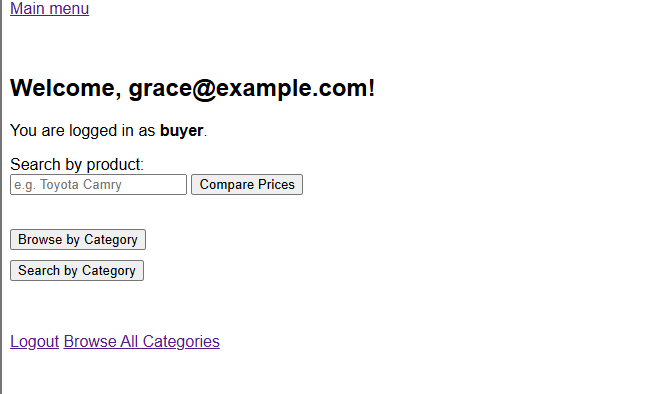

# Localized Price Comparison App
#### ia637_Shylendra_s_25

## Overview
A web-based platform where users can compare product prices across various stores. The system supports three roles: Admins, Sellers, and Buyers, each with dedicated functionalities.

## Key Features
- **Admins**: Manage users, manage stores, view team analytics dashboard, track user activities.

- **Sellers**: Update product prices for their stores, add new products with categorized browsing, manage dynamic pricing with automated discount tracking.

- **Buyers**: Search for products, compare prices across stores, browse all available product categories.

## Technologies Used
Backend: Flask (Python)

Database: MySQL

Frontend: HTML5, CSS3, JavaScript, Chart.js

Session Management: Flask-Session

ORM: Custom database queries via PyMySQL

Deployment: Localhost (future ready for cloud deployment)

## Database Structure

Here is the overall database schema used for the Localized Price Comparison App:


- **Users Table**
  - Stores user credentials (email, password)
  - User roles (Buyer, Seller, Admin)
  - Activity timestamps (created_at, updated_at)

- **Stores Table**
  - Store information (store name, location, contact info)
  - Associated user (seller who owns the store)

- **Categories Table**
  - Hierarchical category structure
  - Supports multi-level browsing (example: Groceries → Vegetables → Potatoes)
  - Includes brands (for groceries, cars) and locations (for houses)

- **Products Table**
  - Product details (name, description, category)
  - Linked to the store and category
  - Supports multiple product categories and subcategories

- **Prices Table**
  - Real-time pricing details
  - Original price, today's price
  - Automatically calculated discount percentage
  - Timestamped for real-time updates

- **Price_History Table**
  - Historical record of price changes
  - Tracks previous price updates for each product
  - Useful for analyzing price trends over time

## Installation Instructions

Follow the steps below to set up and run the Localized Price Comparison App on your local machine:

### 1. Clone the Repository
First, clone the project repository to your local system:

```bash
git clone https://github.com/Clarkson-Applied-Data-Science/ia637_Shylendra_s_25.git
cd ia637_Shylendra_s_25
```

### 2. Set Up the MySQL Database
Install MySQL Server if it is not already installed.

Create a new database (e.g., localized_price_db).

Import the provided SQL schema to create the necessary tables. You can find the schema in the `/Database` folder.

```bash
```

### 3. Update Database Configuration
Open the app.py (or relevant configuration file) and update the database connection details:
```bash
db = pymysql.connect(
    host='localhost',
    user='your_username',
    password='your_password',
    database='localized_price_db'
)
```
Make sure your database credentials match your local setup.

### 6. Access the Application
Run the app and open your web browser and navigate to:
```http://127.0.0.1:5000/```  
You can now use the Localized Price Comparison App locally!

## Key Screens

### 1. Login Page
Secure login for all user roles (Buyer, Seller, Admin).

- **After UI Enhancement:**
  

---

### 2. Admin Dashboard
Analytics panel displaying user counts, active users, and price trends.

- **Before UI Enhancement:**
  

- **After UI Enhancement:**
  

---

### 3. Seller Dashboard
Store-specific product price management and ability to add new products.

- **Before UI Enhancement:**
  

- **After UI Enhancement:**
  

---

### 4. Buyer Dashboard
Product search, price comparisons, and category browsing experience.

- **Before UI Enhancement:**
  

- **After UI Enhancement:**
  


## Usage Instructions

After accessing the Localized Price Comparison App at `http://127.0.0.1:5000/`, users can log in and perform actions based on their assigned roles:

---

### Admin Role
- **Login** using admin credentials.
- Access the **Admin Dashboard**.
- View key analytics, including:
  - Total users
  - Active buyers and sellers
  - Price update trends
- Manage user accounts:
  - Add, update, or deactivate users
- Manage stores:
  - Add or update store details
- Track activities:
  - Monitor recent price updates and user activities

---

### Seller Role
- **Login** using seller credentials.
- Select their store from the list.
- Manage products:
  - Update existing product prices
  - Add new products under specific categories and brands
- Dynamic pricing:
  - System automatically calculates and displays discounts based on original and updated prices

---

### Buyer Role
- **Login** using buyer credentials.
- Browse available product categories:
  - Groceries, Cars, Houses, and more
- Search for products by keyword.
- Compare prices across multiple stores in real-time.
- Filter results based on:
  - Distance
  - Discount percentage
  - Product availability

---
## Test Credentials

For testing purposes, a list of sample user email addresses and passwords has been provided.  
You can find these credentials inside the `/credentials` folder in the project repository.

The list includes accounts for:
- Admin users
- Seller users
- Buyer users

> **Note:** These accounts are meant only for demo and testing purposes. Please ensure to remove or reset them before deploying the application publicly.

## Notable Functionalities

- **Auto-discount Calculation:**  
  Discounts are automatically calculated and updated based on the difference between the original price and today's price using MySQL database triggers.

- **Category Tree Navigation:**  
  Users can browse products through a dynamic, multi-level category structure, enhancing search precision and user experience.

- **Interactive Visualizations:**  
  The Admin Dashboard utilizes Chart.js to visualize user role distributions, active users, and price trends over time.

- **Price History Tracking:**  
  Every price update is logged separately in the `Price_History` table, ensuring that historical price data is preserved and available for future analysis.

---

## Future Enhancements

- **Cloud Deployment:**  
  Deploy the application on a cloud platform such as AWS, Azure, or Render for wider access and scalability.

- **Advanced Authentication:**  
  Enhance login security by implementing OAuth 2.0 or JWT-based authentication systems.

- **Push Notifications:**  
  Add real-time push notifications to alert users about significant price drops or special offers.

- **Location-based Search Optimization:**  
  Improve search results by integrating user location to prioritize nearby stores and offers.


## Conclusion

The Localized Price Comparison App offers a scalable and user-friendly solution for efficient price comparison across multiple product categories.  
By integrating dynamic pricing, real-time updates, and interactive analytics, the platform creates a comprehensive shopping experience for buyers, sellers, and administrators alike.

With future enhancements like cloud deployment, advanced authentication, and real-time notifications, this application is well-positioned to evolve into a full-fledged marketplace platform.

Thank you for exploring this project :)
